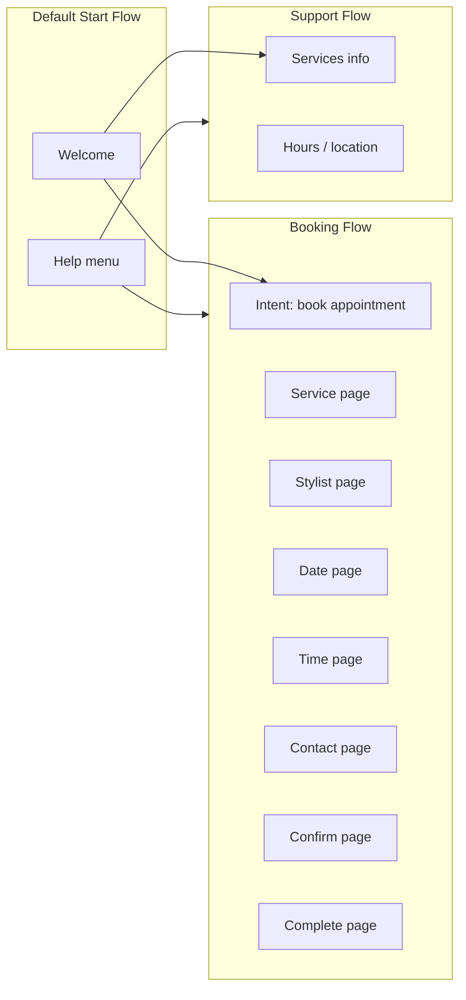

# Flows & pages – suggested structure

## Mermaid overview

## Default Start Flow

- **Entry:** greeting + short Elite Cuts intro + “Say **book**, **services**, or **hours**.”
- **Route to Booking** when user expresses intent to book / reserve / appointment.
- **Route to Support** when user asks what you offer / prices / address / open hours.

## Booking Flow

| Page | User goal | Exit routes |
|------|-----------|-------------|
| Entry | Detect booking | → Service |
| Service | `service` filled | → Stylist (or skip if single-service utterance already has it) |
| Stylist | `stylist` filled | → Date |
| Date | `appointment_date` | → Time |
| Time | `appointment_time` | → Contact |
| Contact | `customer_name` + (`phone` **or** `email`) | → Confirm |
| Confirm | user says yes | → Complete |
| Confirm | user says no | → adjust slot (route back) |
| Complete | thank you + ref number | → End session or Start |

Use **form filling** (CX **Parameters** on page) where your TA expects structured capture.

## Support Flow

- Intent: “What services do you have?” → list with **prices/durations** from `elite-cuts-data.json`.
- Intent: “Where are you?” / “Hours?” → address + hours text.

## Optional extension

- **Cancel booking:** “I need to cancel” → collect reference or name + date → simulated cancel message.
- Not required by slides but mentioned as optional.

## Fallback

- Global or flow-level: “I didn’t catch that. You can say **book an appointment**, **list services**, or **hours**.”
